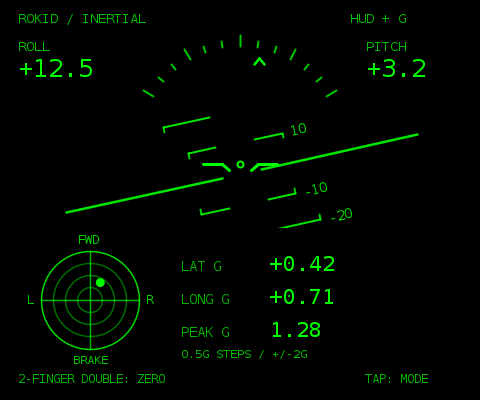

> **非公式・非提携：本プロジェクトは個人開発の非公式アプリです。Rokid社との提携・公認・支援関係はありません。Rokidの名称は対応機種を説明するために使用しています。**
>
> **Unofficial and unaffiliated: This is an independent community project. It is not affiliated with, endorsed by, or sponsored by Rokid. The Rokid name is used only to identify compatible hardware.**

# IMU HUD for Rokid Glasses — 0.1.5

[日本語](#概要--overview) | [English documentation](README.en.md) | [Releases](https://github.com/Xenoah/rokid-imu-hud/releases)

## 概要 / Overview

Rokid Glasses本体で動作する非公式の水平儀＋2軸Gメーター。スマートフォンやBluetooth接続なしで、姿勢・加速度の取得からHUD描画まで完結します。

An unofficial standalone artificial horizon and two-axis G meter for Rokid Glasses. IMU processing, attitude estimation and HUD rendering run entirely on the glasses, without a phone, Bluetooth link or server.

**校正待機に10秒／15秒の上限動作を追加 / Bound calibration waiting with 10s / 15s fallback**

[APK・ソースのダウンロード / Download APK and source](https://github.com/Xenoah/rokid-imu-hud/releases/tag/v0.1.5)

> 正式公開版 / Published release. APKは診断可能なdebug署名ビルドです。実機での精度・性能検証は未完了です。The APK is a debug-signed diagnostic build; device accuracy and performance remain unverified.


## 実機スクリーンショット / Device screenshots

**0.1.5の調査時にユーザーから提供された画像です。最新版の実機動作確認を示すものではありません。**
User-provided images from the 0.1.2 investigation; these do not demonstrate hardware validation of the latest version.

| スマートフォン / Phone HUD | Rokid Glasses / Calibration issue |
| --- | --- |
| 
 | 
 |

グラス画像は約198Hzの入力と旧版の校正待機を記録したものです。下の480×400画像は本番描画コードによるデスクトッププレビューです。
The glasses image records approximately 198Hz input and the old calibration wait. The 480×400 image below is a desktop render made with the production HUD drawing code.

Rokid Glasses（Snapdragon AR1 / YodaOS-Sprite）本体で動作する、水平儀＋2軸GメーターのAndroidアプリ。Java 17で実装しています。通常動作時のスマートフォン、Bluetooth、外部センサー、ネット接続は不要です。

**0.1.5：校正待ちに時間上限を追加。** 通常は約1秒で静止校正します。10秒続いたら判定を緩和し、15秒でも未完了なら妥当なIMU入力を使って暫定基準でHUDを開始します。緩和・暫定開始は `APPROX` と表示し、後からRESETで通常校正へ戻せます。センサー欠落や不正な入力は `IMU DATA ERROR` とし、校正待ちを続けません。詳細は [docs/calibration-fix-0.1.5.md](docs/calibration-fix-0.1.5.md)。

**状態：署名済みデバッグAPKを生成済み。Androidコードのコンパイル、DEX変換、署名・整列検証、11項目のAPK内部検査、47項目の模擬IMU試験に合格しました。** `dist/RokidHUD-0.1.5-debug.apk` を同梱しています。0.1.3のユーザー動画では実機の起動・描画・約247HzのIMU受信を確認しましたが、校正が完了しませんでした。**修正版0.1.5の実機・エミュレーター試験は未実施です。** 実機60fps、継続的な取得レート、ボタン配送、軸の符号は未確認です。

以前の起動・校正修正も含みます。[起動順序の修正](docs/startup-fix-0.1.1.md)、[低頻度姿勢と静止ノイズへの対応](docs/calibration-fix-0.1.2.md)、[0.1.3時点の校正変更](docs/calibration-fix-0.1.3.md)、[OS姿勢からの復帰](docs/calibration-fix-0.1.4.md) は履歴として残しています。

今回は利用できるAOSP Androidビルドツールを直接実行し、APKを生成しました。この作業環境ではGradle取得が制限されるため、GitHub ActionsでGradleビルド・Android lintを実行し、合格を正式リリース公開の条件にしています。直接ビルドの再現方法と検証範囲は [docs/apk-debug-report.md](docs/apk-debug-report.md) を参照してください。



## 実装内容

- 中央固定機体マーカー、姿勢に追従する水平線、10°ごとのPitch ladder、Roll目盛、Pitch/Roll数値。
- 小型の左右・前後Gメーター。±2G、同心円0.5G間隔、短い軌跡、LAT/LONG/PEAK数値。範囲外はドットを円周へ制限し、数値はそのまま表示します。
- OSの `TYPE_GAME_ROTATION_VECTOR` → `TYPE_ROTATION_VECTOR` → 加速度＋ジャイロのMahony方式という優先順位。
- センサー専用スレッド、vsync描画専用スレッド、任意のCSV専用スレッド。200Hzを要求し、描画は60fpsを目標にします。
- 重力除去→RESET時の基準Quaternionの逆回転→G換算→4Hz LPF。PEAKはフィルタ後の2軸合成値の最大。
- 通常約1秒の静止校正。10秒で緩和、15秒で暫定開始。緩和・暫定値は `APPROX` と表示。RESET時は `RECENTERED` を1秒表示。
- 合成HUD／水平儀のみ／Gメーターのみの3モード。
- センサー欠落、ストリーム停止、Quaternion停止・精度不良の検知。古い値は `IMU STALE` として隠します。
- 本体を外す／つるを畳む場合の停止、復帰時の再校正。

## 公式資料と表示サイズの差

2026-09-18 UTCにRokid Open Platform、YodaOS-Sprite、CXR-S、および現行bare-metal開発ガイドの本文を確認しました。**Rokid Max / Station / YodaOS-Master用SDKは使用していません。**

依頼の480×400に対し、現行の[公式UIガイド](https://custom.rokid.com/prod/rokid_web/ff28c865a9634876be98cbc293588460/pc/us/index.html?documentId=161dddee340444108682adb8693fdb20)は物理解像度480×640、上下80pxを除く480×480を推奨しています。本実装は **480×400の論理HUD** を実際のSurfaceへ等方配置します。480×640ではx=0、y=120に配置し、上下の安全帯を守ります。480×400のSurfaceならそのまま表示します。実機では `adb shell wm size` と起動ログで照合してください。

黒は非発光、描画は緑のみです。OS上の他アプリへ重ねる特殊なoverlayではなく、前面Activityを本体ディスプレイへ描画します。光学系による像の位置調整や世界に固定した6DoF描画は行いません。

APIの根拠・URL・未確定事項は [docs/official-research.md](docs/official-research.md) にまとめています。

## ビルド（Windows）

1. Android Studio、JDK 17、Android SDK Platform 35、Build Tools 35.0.0、Platform Toolsを用意します。SDKライセンスは使用するPCで確認してください。
2. このフォルダーをAndroid StudioでOpenします。`local.properties` の `sdk.dir`、または `ANDROID_HOME` でAndroid SDKの場所を指定してください。
3. 初回Gradle同期にはインターネット接続が必要です。通常動作には不要です。
4. PowerShellで実行します。

```powershell
.\gradlew.bat :core:verify :app:assembleDebug :app:lintDebug
# または
.\tools\build.ps1
```

出力：`app/build/outputs/apk/debug/app-debug.apk`。デバッグ署名は各PCで生成されます。署名鍵が異なる既存APKへは上書きできません。

Linux/macOSは `./tools/build.sh`。Gradle 8.11.1の公式Wrapperを同梱しています。固定したAGP 8.9.2 / Gradle 8.11.1 / JDK 17 / compileSdk 35の構成です。minSdkは公式bare-metalガイドに合わせ31。公式サンプルのtargetSdk 36に対して、本プロジェクトのtargetSdkは35です。

`.github/workflows/android.yml` はGitHubへ配置した場合のビルド・APK保存用です。実行結果はGitHubのActionsタブで確認してください。

Gradleを使わず、インストール済みの公式SDKツールを直接使う場合：

```sh
python3 tools/build-apk.py --sdk /path/to/android-sdk
```

SDK Platform 35、Build Tools 35.0.0、JDK 17、Python 3が必要です。今回の作業環境では `--android-jar` と `--tools-dir` で取得済みツールを指定しました（API 36スタブでコンパイル、minSdk 31 / targetSdk 35）。APKのSHA-256とツールのSHA-256は `artifacts/apk-build-status.json` に記録しています。直接ビルドはGradleの代替経路で、Android lintの代替ではありません。

## 初回転送と起動

公式[Quick Start](https://custom.rokid.com/prod/rokid_web/ff28c865a9634876be98cbc293588460/pc/us/index.html?documentId=63837f8f9e3d4f3387517b224e5c9875)は、Rokid AI AppでのADB有効化と**データ転送対応の専用開発ケーブル**を案内しています。付属充電ケーブルのみではデバッグできない場合があります。開発ケーブルはRokid公式開発者窓口へ確認してください。

```powershell
adb devices
adb shell getprop ro.build.version.sdk
adb shell wm size
adb install -r app/build/outputs/apk/debug/app-debug.apk
adb shell am start -n dev.xenoah.rokidhud/dev.xenoah.hud.MainActivity
```

同梱APKを使う場合のパスは `dist/RokidHUD-0.1.5-debug.apk` です。配布済み0.1.0〜0.1.4と同一署名なので `adb install -r` で上書きできます。署名の異なる別ビルドがある場合、`INSTALL_FAILED_UPDATE_INCOMPATIBLE` になります。自動アンインストールは行いません。必要なログを保存してから旧版を削除すると、そのアプリの保存データも消去されます。

または `tools/install.ps1`。複数のAndroid機器が見える場合は `-Serial 実機シリアル` を付けます。ADBが `unauthorized` なら正規の認証手順を完了してください。

一度インストールした後は、ファームウェアのアプリ一覧から「Rokid HUD」を起動します。ファームウェアがサイドロードアプリを一覧表示しない場合の独立起動方法は実機確認が必要です。本アプリはLauncherを書き換えたり、システムをroot化したりしません。起動後にPCを外し、スマートフォンとBluetoothがなくても動作することを実機チェック表で確認してください。

## 本体操作

| 操作 | 動作 | 公式イベント |
| --- | --- | --- |
| 右タッチパネルを**2本指でダブルタップ** | 静止校正してRESET | `com.android.action.ACTION_TWO_FINGER_DOUBLE_TAP` |
| 1本指でシングルタップ | 3モード切替 | `KEYCODE_ENTER` のUP |
| 1本指でダブルタップ | 戻る／終了 | `KEYCODE_BACK` をOSへ委譲 |
| Function Button長押し、AI長押し、設定、ペアリング | OSの動作を維持 | 本アプリは購読・抑止しない |

RESETは前面・装着中のみ受け付け、重複イベントを750msで抑制します。2本指ダブルタップは公式掲載のイベントで、**任意に推測したキーコードではありません**。到達とファームウェア側の併存動作は実機未確認です。動的receiverのみを使い、`abortBroadcast()` は呼びません。2本指シングルタップは公式文書内で対応の記述が不一致なため採用していません。

## 校正

| 時間・状態 | 動作 |
| --- | --- |
| 通常 | `CALIBRATING / KEEP HEAD STILL`。約1秒の連続した静止を集計 |
| 10秒経過 | `EASY CALIBRATION`。集計窓を0.5秒へ短縮し、振動・角速度分散・傾斜の判定を緩和 |
| 15秒経過 | 未完了でも、入力が新鮮で妥当な範囲なら暫定基準でHUDを開始 |
| 欠測・不正入力 | `IMU DATA ERROR`。入力を確認してRESETで再試行 |

タイマーは校正を要求した時点から数え、窓の取り直しや姿勢源の変更では延長しません。期限はセンサー処理と500ms周期の監視で確認します。緩和・暫定開始ではHUD上部に **`APPROX`** を表示します。頭を止めて2本指ダブルタップし、通常条件の校正に成功すると消えます。

通常経路では加速度・ジャイロを各20サンプル以上集計し、大きさ・平均・分散と平滑化した生加速度方向を検査します。OS姿勢だけの変化では生データ窓を消さず、不安定なOS姿勢は自前融合へ切り替えます。通常の約1秒、姿勢源切替を含む約2秒という経路も維持しています。

**15秒で暫定開始する場合は、新しいバイアスを無理に学習しません。** 以前確定した補正値を保持し、初回ならアプリの追加補正をゼロとして、現在の加速度方向から初期姿勢を作ります。加速中の傾きや未補正バイアスによる誤差・ドリフトは増え得ます。これは表示開始を優先した暫定値であり、静止校正の完了と同じ精度を保証するものではありません。

**6軸IMUだけでは一定Yawと一定ジャイロオフセット、持続並進加速度と重力を完全には区別できません。** 精度が必要な場合は静止してRESETしてください。OS姿勢がない場合の加速度バイアス推定は、重力方向の残差に限ります。単一姿勢で全軸の誤差を求める工場校正の代替ではありません。

起動は `READY`、再設定は `RECENTERED` を1秒表示。姿勢基準・G基準・LPF・Peakは校正または暫定開始時に初期化します。画面には経過秒・15秒の上限、ACC、GYRO、実効Hz、OS姿勢の変化 `POSE`、生加速度方向の変化 `TILT`、`GYRO MEAN` を表示します。

## 座標・演算・調整

[docs/coordinates-and-fusion.md](docs/coordinates-and-fusion.md) に数式と符号を記載しています。デバイス軸は公式の+X右、+Y上、+Z装着者側。LAT正＝右への加速度、LONG正＝前方（−Z）への加速度。ドットは加速度方向へ動き、慣性力の向きではありません。

`core/.../Config.java` の `G_FILTER_CUTOFF_HZ`、`HUD_FILTER_TAU_S`、`FUSION_KP`、静止判定しきい値を調整できます。標準は200Hz要求、G表示4Hz LPF、姿勢融合の表示平滑化12ms。レンダラー自身はセンサー値を積分しません。

実機軸が仕様と異なる場合は、実機手順で符号を確認し、`SensorController.java` の `AxisMap(1,2,3)` を正しい右手系の符号付き軸置換に変更します。加速度・ジャイロ・Quaternionを一緒に変換する実装です。未確認の自動推定で軸を変更しません。

## ログ

通常はセンサー一覧・選択・表示サイズ・イベント・異常をLogcatへ記録。校正中は約3秒ごとに待機理由、進捗、実効Hz、加速度／角速度の大きさ、標準偏差も記録します。CSVとHz表示を有効にするには初回起動時のIntentへ `debug` を指定します。

```powershell
adb shell am force-stop dev.xenoah.rokidhud
adb shell am start -n dev.xenoah.rokidhud/dev.xenoah.hud.MainActivity --ez debug true
adb logcat -v threadtime RokidHUD:I "*:S"
# 使用後、CSVとファームウェア・センサー情報をPCへ保存
.\tools\collect-logs.ps1
```

CSVはアプリのprivate領域 `files/hud-debug.csv`。10Hzで最大36,000行（約1時間）、次のdebug起動で上書き。校正理由・標準偏差・OS姿勢棄却・`cal_pose_range_deg`・`cal_gyro_mean_rad_s` に加え、`cal_raw_tilt_deg` を記録します。0.1.5では経過秒 `cal_elapsed_s`、緩和フラグ `cal_relaxed`、品質 `cal_quality` を追加しました（全38列）。GPS・音声・カメラ・ネット送信はありません。`run-as` によるCSV取得にはdebug APKが必要です。描画時間はCPUでの描画・post所要時間であり、光子が目に届くまでのmotion-to-display latencyの実測ではありません。

自前融合の実機確認：起動時に `--ez force_fusion true` を追加してください。

実機へ転送し、起動・プロセス生存・校正完了・アプリのログを20秒間確認するスクリプトも同梱しています。

```powershell
python .\tools\debug-device.py --apk .\dist\RokidHUD-0.1.5-debug.apk
# 複数端末がある場合は --serial 実機シリアル を追加
```

実行中は頭を静止させてください。結果は `device-logs/日時/result.json`、CSV、Logcatへ保存します。0.1.1ではプロセスID取得前に起動失敗しても、アプリのUIDで `startup-logcat.txt` を採取します。`RUNTIME_SMOKE_PASS` は起動・プロセス生存・有効センサーデータの確認であり、傾斜・ボタン・60fpsの合格判定ではありません。結果JSONの `calibration_quality` で通常・緩和・暫定開始を区別できます。このスクリプト自体も接続実機では未実行です。疑似ADBによる3種類の失敗経路のログ保存試験を実施済みです。

## 検証

```powershell
.\tools\test-core.ps1
```

JDK 17のみで演算部の回帰試験を実行できます。Linuxは `tools/test-core.sh`。試験結果は [artifacts/core-test-results.txt](artifacts/core-test-results.txt)、検証範囲は [docs/verification.md](docs/verification.md)、実機記録用紙は [docs/device-acceptance.md](docs/device-acceptance.md)。プレビューは `tools/Preview.java` が本番の `HudRenderer` を使用して生成しています。Androidのフォント・アンチエイリアス・光学表示を再現した実機スクリーンショットではありません。

## 既知の制約

- **測るのはメガネ本体に加わった加速度です。車両固定IMUではないため、頭部運動・回転中心からの距離・歩行振動が混入します。** LPFだけで車両加速度と頭部加速度を分離することはできません。
- 6軸IMUだけでは持続する並進加速度と重力による傾きを完全に識別できません。自前融合では重力補正をゲートしますが、小さい持続加速度は傾きへ混入し得ます。OS Quaternionにも提供側の推定誤差があります。
- GAME_ROTATION_VECTOR／自前6軸融合のYawは長時間でドリフトし、RESET時の前後左右G軸へ影響し得ます。Pitch/Roll表示は重力方向から求めるためYaw単独の回転に依存しません。
- 自前校正には静止の前提が必要です。一定速度のYaw回転と一定のジャイロオフセットは区別できず、回転中に校正すると回転をバイアスに取り込む場合があります。
- 静止校正は温度変化、スケール誤差、全軸バイアスを保証しません。センサーの実在種別・実効Hz・ノイズは個体／ファームウェアで変わります。
- OS姿勢サンプル間はバイアス除去済みジャイロで最大100msだけ姿勢を進めます。ライブG計算では、この姿勢と加速度の時刻差が30msを超える場合、または最後のOS姿勢から100msを超えた場合を有効値にしません。高速回転では時間ずれが見かけの加速度を生むため、実機でログ確認が必要です。
- ±90°付近のPitchではRollが不定になり、倒立で表示が切り替わり得ます。日常の頭部姿勢を対象とした表示です。
- 物理位置や速度を推定しません。加速度の二重積分もありません。航法・操縦・車両制御に用いる認証計器ではありません。
- 60fps・100Hz以上・連続電池持ちは目標値です。実機なしで達成を保証しません。

## 構成

| パス | 内容 |
| --- | --- |
| `app/` | Android Activity、公式入力、SensorManager、SurfaceView、ログ |
| `core/` | Quaternion、融合、校正、G演算、共通描画、47項目の試験 |
| `tools/` | ビルド、転送、ログ収集、JDKのみの試験、プレビュー生成 |
| `docs/` | 公式資料調査、数式、検証記録、実機チェック表 |
| `artifacts/` | 模擬試験結果と共通描画コードによるプレビュー |

本プロジェクト独自コードはMITライセンス。Gradle Wrapperのライセンスは `THIRD_PARTY_NOTICES.md` と `licenses/gradle-LICENSE.txt` を参照してください。

## 公開バージョン

0.1.5はversionCode 7です。先行配布の0.1.5-preview（versionCode 6）から更新できます。姿勢・G演算とHUD描画は先行previewと同一です。公開時にAndroid 12向けイベント登録を専用メソッドへ分離し、そのAPI 31/32限定の呼び出しにlint注記を付けています。
